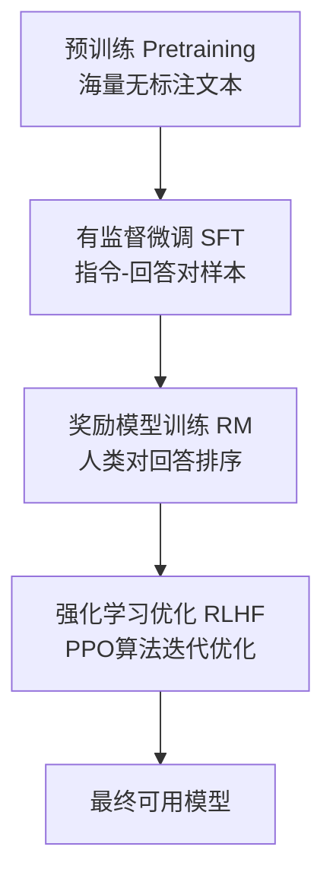
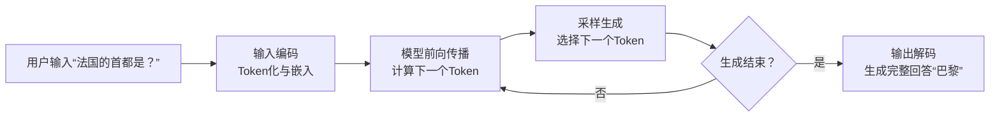
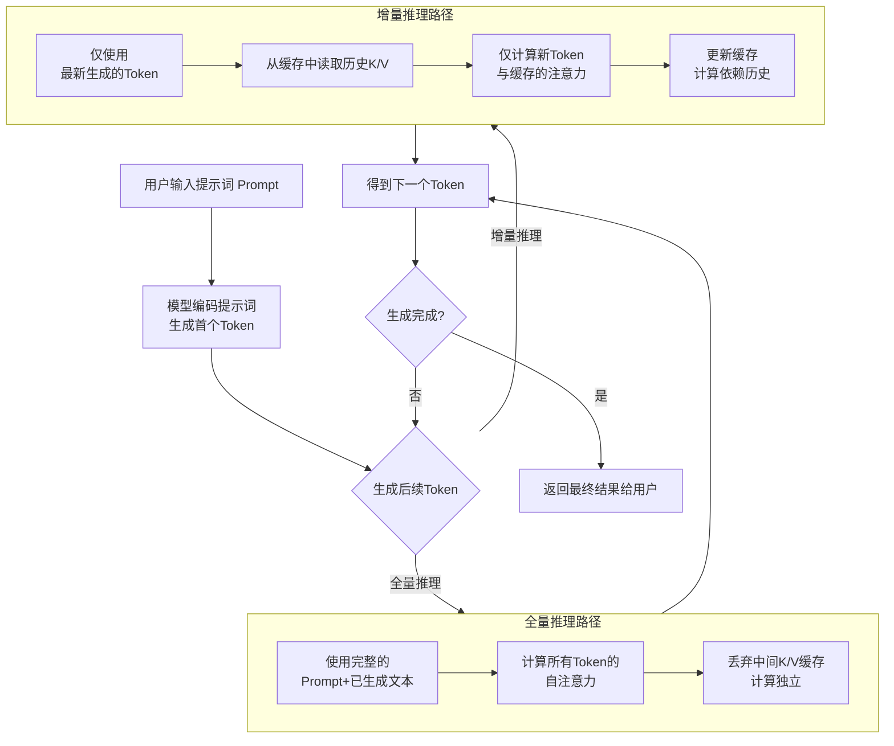

记录最近学习大模型的进展，主要参考 [Stanford CS336](https://stanford-cs336.github.io/spring2025/)。感谢将课程资源开源的教授们！

P.S. 笔记整理使用了 DeepSeek 和 Gemini 作为助理。

---

## 深度学习：从小模型到大模型

- 大模型：人工智能三要素的变化
	- 算法：参数量 Million $\rightarrow$ Billion
	- 数据：训练数据增加，单个模型训练数据集可多达万亿 Token
	- 算力：FLOPs $\rightarrow$ EFLOPs

| 特征维度 | 大模型 (Large Language Models, LLMs)                                                                                                                                        | 小模型 (Small Models)                                                                      |
| :------- | :-------------------------------------------------------------------------------------------------------------------------------------------------------------------------- | :----------------------------------------------------------------------------------------- |
| 核心理念 | 规模至上：通过巨大的模型容量和海量数据，学习通用的知识和能力，通过“涌现”获得泛化性。                                                                                        | 任务特定：为特定任务设计最优结构，追求在有限资源下的最佳效率。                             |
| 参数量   | 巨大：通常为亿级（100M+）甚至万亿级（Trillion），例如 GPT-3 有 1750 亿参数。                                                                                                | 较小：通常为千级到百万级，很少超过亿级。                                                   |
| 训练数据 | 海量无标注数据：使用整个互联网规模的文本、代码等进行无监督/自监督预训练。                                                                                                   | 少量标注数据：通常依赖高质量、针对特定任务的标注数据集进行训练。                           |
| 能力特点 | 通用性强（基座模型）：具备语言理解、生成、推理、代码等广泛能力，通过提示（Prompt） 适应各种任务。                                                                           | 专用性强：在单一任务（如垃圾邮件识别、情感分类、特定图像分类）上表现精准、高效。           |
| 开发范式 | 预训练 + 微调/提示：<br>1. 预训练：成本极高，耗资数百万美元，只有大公司能完成。<br>2. 部署应用：通过微调（Fine-tuning） 或提示工程（Prompt Engineering） 快速适配下游任务。 | 从零训练：针对特定任务，直接收集数据、设计模型架构并进行训练。                             |
| 基础设施 | 要求极高：需要大规模 GPU 集群（如 NVIDIA A100/H100）进行训练和推理，推理成本也高。                                                                                          | 要求低：可在单个 CPU 或小型 GPU 上完成训练和部署，甚至可在手机、嵌入式设备（IoT）上运行。  |
| 优势     | 功能强大、泛化能力超强、打破任务边界、开发效率高（无需为每个新任务重新设计模型）。                                                                                          | 速度快、成本低、隐私性好（数据可本地处理）、透明可控、部署简单。                           |
| 劣势     | “黑箱”性质、推理成本高、存在幻觉（生成错误信息）、能耗大、数据偏见难消除。                                                                                                  | 泛化能力差（换一个任务可能完全无效）、依赖高质量标注数据、需要大量领域专家知识来设计模型。 |
| 典型代表 | GPT-4、ChatGPT、Llama、Gemini、文心一言                                                                                                                                     | BERT-base、ResNet-50、SVM、线性回归、决策树                                                |

大模型和小模型不是替代关系，而是互补关系。 未来的趋势是“大小协同”的混合 AI 架构：

1. 云端大脑：复杂、通用的任务由云端的大模型处理。
2. 终端小脑：简单、高频、对延迟和隐私要求高的任务由设备终端的小模型处理。

## 大模型概览

### 发展历程

```
精确度 accuracy = 效率 efficiency x 资源 resources
```

- 神经网络之前（2010 年以前）
	- 语言模型：主要用于衡量英文的熵，并以 n-gram 为主，应用于机器翻译和语音识别。
- 神经网络基石（2010 年代）
	- 2003 年：首个神经网络语言模型诞生。
	- 2014 年
		- 出现序列到序列（Seq2Seq）模型，用于机器翻译。
		- 发布 Adam 优化器。
		- 引入 Attention 机制，显著提升机器翻译性能。
	- 2017 年
		- Transformer 架构问世，彻底改变了 NLP 领域。
		- 提出 Mixture of Experts (MoE) 架构。
	- 2018 年：研究模型并行化技术。
- 早期基础模型（2010 年代末）
	- 2018 年
		- ELMo 出现，采用 LSTM 预训练和微调，提升了任务表现。
		- BERT 问世，采用 Transformer 架构预训练和微调，成为主流。
	- 2019 年：谷歌 T5 将所有任务都转化为文本到文本的形式。
- 规模化浪潮与闭源模型
	- 2019 年：OpenAI GPT-2 发布，首次展现出零样本能力，并以阶段性方式发布。
	- 2020 年
		- 规模法则（Scaling Laws） 提出，为模型扩展提供了可预测性。
		- OpenAI GPT-3（1750 亿参数）发布，首次展现上下文学习（In-context learning）能力，模型为闭源。
	- 2022 年
		- 谷歌 PaLM（5400 亿参数）发布。
		- DeepMind Chinchilla 提出计算最优的规模法则。
- 开源模型崛起
	- 2020 年起：EleutherAI 开放数据集（The Pile）和模型（GPT-J），推动开源生态。
	- 2022 年
		- Meta OPT 复制了 GPT-3，但遇到硬件挑战。
		- Hugging Face / BigScience BLOOM 专注于数据来源的透明化。
	- 2023 年起：Meta Llama 系列模型发布。
	- 2024 年
		- 阿里巴巴 Qwen 和 DeepSeek 系列模型发布。
		- AI2 OLMo 2 模型发布。
- 开放程度的层次
	- 闭源（Closed）：如 GPT-4o，只能通过 API 访问。
	- 开放权重（Open-weight）：如 DeepSeek，提供模型权重，但训练数据细节不透明。
	- 开源（Open-source）：如 OLMo，提供模型权重和训练数据，并公开大部分细节。
- 当前前沿模型
	- 包括 OpenAI o3、Anthropic Claude Sonnet 3.7、xAI Grok 3、Google Gemini 2.5、Meta Llama 3.3、DeepSeek r1、阿里巴巴 Qwen 2.5 Max、腾讯 Hunyuan-T1。

### 分类

- 技术架构：
	- Transformer 结构
		- Encoder-Decoder
		- Encoder-Only
		- Decoder-Only
	- 混合专家模型 MoE
- 多模态：图片、视频、文本、语音
- 场景：通用模型（基础底座） $\rightarrow$ 行业模型（金融、医药等） $\rightarrow$ 垂直场景模型（财务异常检测、金融违约、小分子优化）

{: w="500"}

> 图片来源：[2024年中国大模型行业应用优秀案例白皮书](https://img.frostchina.com/attachment/17360928/xw7WtsoTq8TzpELcd4n6VH.pdf)

### 基础模型（Foundation Model）

- 定义：在广泛数据（通常是互联网规模的超大规模数据）上经过预训练的大规模人工智能模型。它学习到的是一种极其通用和强大的世界表征（包括语言、视觉、逻辑等），可以作为下游各种任务的基础和起点。

```
基础模型 = 超大规模数据 + 大规模神经网络架构（如 Transformer）+ 自监督/无监督预训练
```

- 特征
	- 涌现能力（Emergent Abilities）
	    - 当模型规模（参数、数据、计算量）扩大到一定程度时，它会突然展现出在小模型中不存在的新能力，如推理、创作、思维链（CoT） 等。这是一种“量变引起质变”的现象，是基础模型最神奇的特性之一。
	- 同质化（Homogenization）
	    - 一种架构（如 Transformer）统治了几乎所有模态（语言、图像、音频、代码）。这意味着所有领域的技术进步可以相互促进，加速了整个 AI 领域的发展。
	- 新的开发范式：预训练 + 微调/提示（Pre-training + Fine-tuning / Prompting）
	    - 预训练：耗费巨资在海量数据上训练模型，获得通用能力。这一步通常只有大公司或研究机构才能完成。
	    - 适应下游任务
	        - 微调（Fine-tuning）：用特定领域的数据对基础模型进行额外训练，使其专业化（如法律、医疗模型）。
	        - 提示（Prompting）：无需更新模型权重，仅通过设计好的指令或示例（即 Prompt），即可引导模型完成特定任务。这极大地降低了 AI 的使用门槛。
- 挑战与风险
	- 幻觉（Hallucination）：生成看似合理但实际错误或虚构的内容。
	- 偏见与毒性（Bias & Toxicity）：模型会放大其训练数据中存在的社会偏见和有害内容。
	- 可控性与对齐（Alignment）：如何让模型的行为与人类的意图、价值观和安全准则保持一致是一个巨大挑战（这就是 RLHF 等领域正在解决的问题）。
	- 成本与资源：算力需求巨大，训练和部署成本极高。
- 典型示例
	- 大语言模型（LLMs）
		- GPT-4, ChatGPT, LLaMA 3, Claude
		- 以上均为最典型的基础模型，主要基于文本数据训练，但展现出强大的通用能力。
	- 多模态模型
	    - GPT-4V (Vision), Gemini 1.5
	    - 能够同时理解和处理文本、图像、音频等多种信息。
	- 代码模型
	    - Codex, Code Llama
	    - 在代码数据上训练，用于代码生成、补全和解释。
	- 科学模型
	    - AlphaFold 2（用于蛋白质结构预测）
	    - 虽然架构不同，但其“预训练 + 微调”的思想与基础模型范式一致。

#### 涌现（Emergence）

- 当模型的规模（参数数量、训练数据量）达到某个临界点后，模型突然展现出其在小规模时所不具备的、甚至是意想不到的新能力。
- 这些新能力并非通过编程或特定设计来实现的，而是自发地、内在地从模型中“涌现”出来。
- More is different：关注参数数量 100 亿至 1000 亿的“涌现”现象。


> 图片来源：[Emergent Abilities of Large Language Models](https://arxiv.org/abs/2206.07682)

#### 思维链（Chain-of-Thought, CoT）

- CoT：让大语言模型（LLM）能够更好地处理复杂任务的技术。
- 思维链通过鼓励模型逐步思考，将一个复杂的推理任务分解成多个简单的中间步骤，最终得出答案。
- 为什么需要 CoT？（Why）
	- 大模型在处理需要多步推理的复杂问题时，常常会犯错。例如，当问题涉及到逻辑、数学计算或多方面信息整合时，模型可能会跳过推理过程，直接给出错误的答案。
	- 思维链的核心思想是：与其让模型直接给出答案，不如先让它把思考过程打印出来。这个“思考过程”就是思维链，它能引导模型进行更严谨、更系统的推理。
- CoT 的两种主要方法
	- 零样本思维链（Zero-Shot-CoT）：在问题后面加上一句提示词，比如：“让我们一步一步地思考。” 模型在看到这个提示后，通常会开始进行分步推理。
	- 少样本思维链（Few-Shot-CoT）：通过在提示词中提供几个“问题 - 思维链 - 答案”的例子，来教导模型如何进行分步推理。

### 端到端训练 AI 大模型的理论时间

#### 公式与假设

$$
E_T = \frac{8 * T * P}{n * X}
$$

- $E_T$： 一个 Epoch 所需的理论训练时间（秒）。一个 Epoch 代表模型完整看过一遍训练数据集。
- $T$： 训练数据集中的总样本数量。
- $P$： 处理一个样本（进行一次前向传播和反向传播）所需的平均计算量，单位是 FLOPs。这是一个关键值，取决于模型架构（如 Transformer 的层数、隐藏层大小等）。
- $n$： 用于训练的 GPU/NPU ( accelerator ) 的数量。
- $X$： 单个 GPU/NPU 的实际持续计算性能，单位是 FLOPs。
- $8$： 魔法数字。核心假设：在标准的混合精度训练中，处理一个样本所需的总计算量 `P`（前向传播 + 后向传播），约为其前向传播计算量的 4 倍。而同时，为了实现分布式梯度同步，通信量又大约是计算量的 2 倍。因此，总开销放大为 4 * 2 = 8 倍。

#### 局限性

上述公式是一个极度理想化的模型，它假设了以下完美条件，在实际环境中几乎不可能达到：
- 完美线性扩展： 假设增加设备数量 `n`，速度就能线性提升。实际上，通信开销会随着 `n` 的增加而非线性增长。
- 无其他开销： 忽略了数据加载与预处理（I/O 瓶颈）、模型保存（Checkpointing）、日志记录、CPU 到 GPU 的数据拷贝等所有其他开销。
- 通信与计算完美重叠： 公式假设通信和计算不能重叠。现代深度学习框架（如 PyTorch 的 DDP）和硬件（NVLink, RDMA）会尽可能让通信和计算重叠，从而降低 `8` 这个因子的实际值。高效的集群上，这个因子可能更接近 `3~5`。
- 固定的有效算力 `X`： 假设 `X` 是一个恒定值，但实际上它可能会因 batch size 大小、内存带宽限制等原因而波动。
- 均匀的数据和计算： 假设每个样本的计算量 `P` 完全相同。

## 大模型训练及推理流程：以 ChatGPT 为例


> 图片来源：[OpenAI 博客](https://openai.com/zh-Hans-CN/index/chatgpt/)

### 训练阶段（Training）

- 核心目标：学习下一个词预测 (Next-Token Prediction)。所有流程最终都服务于一个核心任务：给定一段上下文，让模型预测下一个最可能出现的词（Token）。
- 训练流程主要阶段：



- 预训练 (Pretraining)
	- 目标：让模型获得通用的语言理解和生成能力，学习语法、事实知识、基本逻辑。
	- 数据：海量的无标注文本数据（如网页、书籍、代码等），通常达到 TB 甚至 PB 级别。
	- 方法：自监督学习。使用一种叫做“掩码语言模型”（MLM）或“因果语言模型”（CLM）的任务。
	    - 例如：给模型一句话“今天天气真 `[MASK]` 啊！”，让它预测 `[MASK]` 处应该是“好”还是“坏”。通过数十亿次这样的练习，模型逐渐理解了语言。
- 有监督微调 (Supervised Fine-Tuning, SFT)
	- 目标：教会模型理解和遵循人类的指令，并以其期望的方式回答问题。
	- 数据：高质量的、人工编写的指令 - 回答对数据集。
	- 方法：在预训练模型的基础上，用这批高质量的指令数据继续进行有监督的下一词预测训练。
- 奖励模型训练 (Reward Modeling, RM)
	- 目标：训练一个单独的、小型的新模型（奖励模型），让它学会评判什么样的回答是人类更偏好的。
	- 数据：同一个指令，对应多个不同的模型输出，由人类标注员对这些输出进行排序。
	- 方法：用这些排序数据训练一个模型，输入是指令和回答，输出是一个分数（奖励值），代表回答的质量。
- 强化学习优化 (Reinforcement Learning from Human Feedback, RLHF)
	- 目标：让 SFT 模型的输出进一步对齐人类的偏好。
	- 方法：使用强化学习（最常用 PPO 算法）来优化 SFT 模型。
	    - 演员（Actor）：需要被优化的 SFT 模型。
	    - 裁判（Critic）：上一步训练好的奖励模型（RM）。
	    - 过程：模型生成一个回答，奖励模型给它打分。强化学习算法根据这个分数来调整模型参数，使其未来更倾向于生成能获得高分的回答。同时会加入约束，防止模型为了得高分而输出无意义但“安全”的内容。

### 推理阶段 (Inference)

- 推理流程核心步骤：



- 输入处理 (Input Processing)
	- Token 化：将用户的输入文本（Prompt）分割成模型能理解的单元（Token）。
	- 嵌入查找：个 Token 转换成一个高维向量（Embedding）。
- 模型前向传播 (Forward Pass)
	- 输入向量经过模型的所有层（Transformer 层）进行复杂的数学计算。
	- 最终输出一个概率分布（Logits），表示词汇表中每个词作为下一个词出现的可能性。
- 采样生成 (Sampling)
	- 模型不会总是选择概率最高的词（那样会生成枯燥、重复的文本）。
	- 会采用一些采样策略来增加多样性：
	    - 贪心搜索：总是选择概率最高的词。简单但容易重复。
	    - 束搜索：保留几个最可能的候选序列，适合目标明确的任务（如机器翻译）。
	    - 温度采样：通过调节“温度”参数来控制输出的随机性。温度高更随机有创意，温度低更稳定可预测。
	    - Top-k / Top-p 采样：只从概率最高的 k 个词中选，或从累积概率超过 p 的最小词集中选。
- 循环生成 (Looping)
	- 将新生成的 Token 追加到输入中，再次进行前向传播，预测下一个 Token。
	- 如此循环，直到生成一个表示结束的特殊 Token（如 `<eos>`）或达到最大长度限制。

#### 全量推理 vs 增量推理

- 核心区别：如何处理上一次的计算结果来优化下一次的计算。
	- 全量推理（Full Inference）：每次推理都是独立的、全新的计算，不利用任何之前的中间结果。
	- 增量推理（Incremental Inference）：利用上一次计算缓存下来的中间结果（特别是注意力机制的 Key 和 Value 向量），来极大地加速当前步骤的计算。



- 全量推理 (Full Inference)：也称为“冷启动”推理或“无状态”推理。
	- 原理：在生成每一个新 Token 时，模型都会将整个序列（最初的 Prompt + 到目前为止已生成的所有 Token）作为输入，从头到尾重新计算整个网络的前向传播。这包括重新计算所有 Token 之间的自注意力（Self-Attention）分数。
- 增量推理 (Incremental Inference)：也称为“自回归推理”或“有状态”推理。其核心思想是缓存（Cache） 并复用（Reuse）已计算过的中间结果。
	- 原理
		1. 预填充阶段（Prefill Phase）：
		    - 处理用户输入的 Prompt 时，模型会进行一次性全量计算，生成第一个 Token。
		    - 在此过程中，模型会将每个 Transformer 层中注意力机制的 Key（K）和 Value（V）向量缓存起来。
		2. 生成阶段（Decoding Phase）：
		    - 当要生成下一个 Token 时，模型不需要重新处理整个长序列。只需要将最新生成的那个 Token 作为输入。
		    - 在计算注意力时，新 Token 的 Query（Q）向量会去与缓存中所有历史 Token 的 K、V 向量进行计算，从而得到上下文表示。
		    - 计算完成后，将新 Token 自身的 K、V 向量也追加到缓存中，为生成再下一个 Token 做准备。
